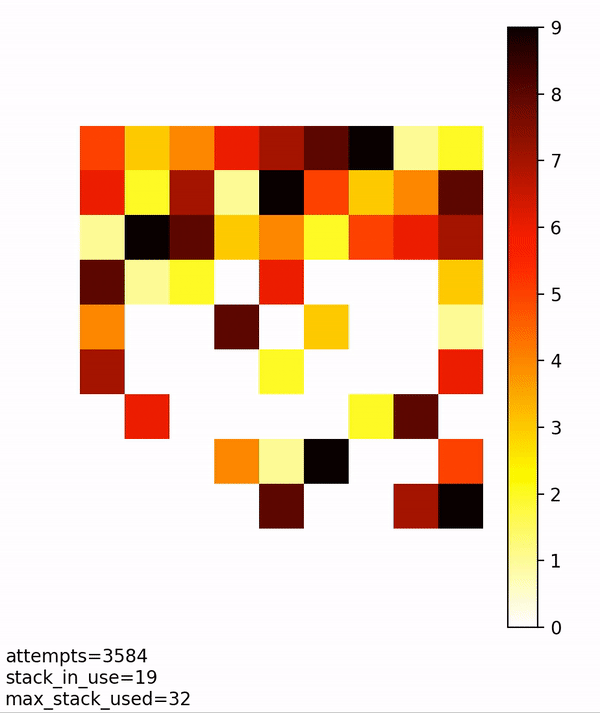

# Description
This project contains a set of puzzle solvers.

The solvers use a greedy backtracking strategy to solve the puzzles.

## sudoku-solver
Input should be provided as follows:
```
board_to_solve = [
    ["5", "3", ".", ".", "7", ".", ".", ".", "."],
    ["6", ".", ".", "1", "9", "5", ".", ".", "."],
    [".", "9", "8", ".", ".", ".", ".", "6", "."],
    ["8", ".", ".", ".", "6", ".", ".", ".", "3"],
    ["4", ".", ".", "8", ".", "3", ".", ".", "1"],
    ["7", ".", ".", ".", "2", ".", ".", ".", "6"],
    [".", "6", ".", ".", ".", ".", "2", "8", "."],
    [".", ".", ".", "4", "1", "9", ".", ".", "5"],
    [".", ".", ".", ".", "8", ".", ".", "7", "9"]]
```

The solver can be supplied with a `Printer` object that shows its current progress.

The following implementations of `Printer` are provided. 
* matplotlib
* stdout
* tkinter

### Matplotlib example:




## crossword-solver
```python
crossword = [
    '++++++-+++',
    '++------++',
    '++++++-+++',
    '++++++-+++',
    '+++------+',
    '++++++-+-+',
    '++++++-+-+',
    '++++++++-+',
    '++++++++-+',
    '++++++++-+'
]

words = 'ICELAND;MEXICO;PANAMA;ALMATY'
solved = crosswordPuzzle(crossword, words)
```

`Output: `
```
++++++I+++
++MEXICO++
++++++E+++
++++++L+++
+++PANAMA+
++++++N+L+
++++++D+M+
++++++++A+
++++++++T+
++++++++Y+
```
